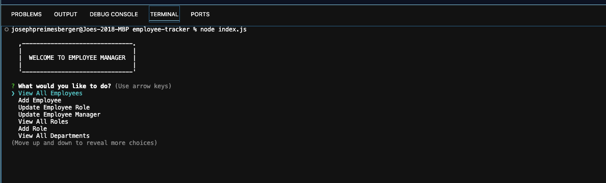
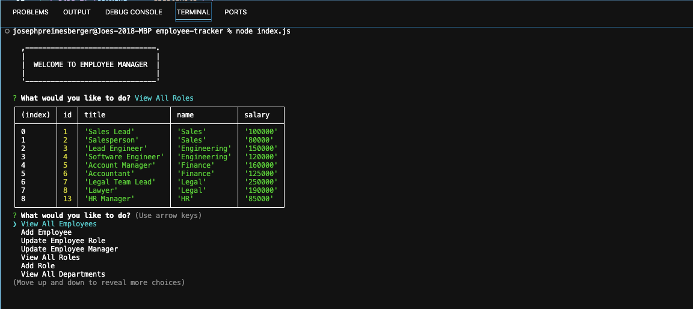

# Employee Tracker

## Description

The purpose of this project is to build a command-line application from scratch to manage a company's employee database, using Node.js, Inquirer, and MySQL.

## Installation

A video showing the functionality of this project can be found here: https://drive.google.com/file/d/1I5cgg9bFjgNT4uFj1uQnX3WCpOHp9xzt/view

## Usage

The application takes in user input as shown in the following screenshot:

The generated data will appear as it does in the following screenshot:

## Credits

N/A

## License

Copyright (c) 2023 Joe Preimesberger

Licensed under the MIT license.